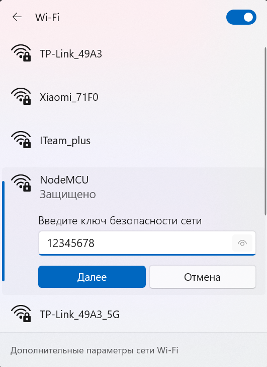
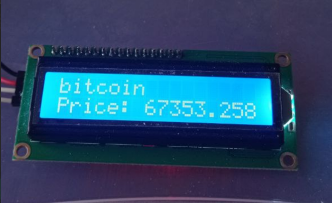

<h1>Description of the assembly of this project:</h1>

1. Equipment and components:
   * NodeMCU (any version, for example, NodeMCU v1.0 (ESP-12E Module));
   * LCD display 1602 with I2C module;
   * Wires for connection.
2. Connection. Connect the display to the NodeMCU. To do this, use the following connection diagram:
   * VCC on display to VIN on NodeMCU;
   * GND on display to GND on NodeMCU;
   * SDA on display to D2 (or other SDA pin) on NodeMCU;
   * SCL on display to D1 (or other SCL pin) on NodeMCU.
3. Preparing the Arduino IDE:
   * Install the library to work with LCD 1602 and I2C. In the Arduino IDE, go to "Manage Libraries" and install the "LiquidCrystal I2C" library;
   * Add NodeMCU support to the Arduino IDE if you haven't already. To do this, in "Settings" add a link to additional board URLs: `http://arduino.esp8266.com/stable/package_esp8266com_index.json` . After that, through the "Board Manager" find and install the package for the ESP8266.
4. Open your working folder in command prompt and run the command - 
`git clone https://github.com/IgorVolokho99/CryptoDisplay.git`
5. Connect NodeMCU via USB to your computer and upload the code to NodeMCU;
6. After running the code, you will see the “First start” message on the display and NodeMCU will launch a local server, which you can connect to from a computer, laptop or smartphone via Wi-Fi:
    
   * Take any device with Wi-Fi functionality. Open the list of available Wi-Fi networks. And find the Wi-Fi network provided by NodeMCU:
      * name: `NodeMCU`
      * password: `12345678`
   
   * After connecting your device to the Wi-Fi network of the NodeMCU device, open the browser on this device and enter the local IP of the web interface in the address bar:
      * `192.168.4.1`
   * You will see a window for entering your login and password. You need to enter the username and password of your work Wi-Fi network so that NodeMCU can send requests to the Internet. After entering, you will see the message “Connected” if you did everything correctly.
   
7. Enjoy!
   
